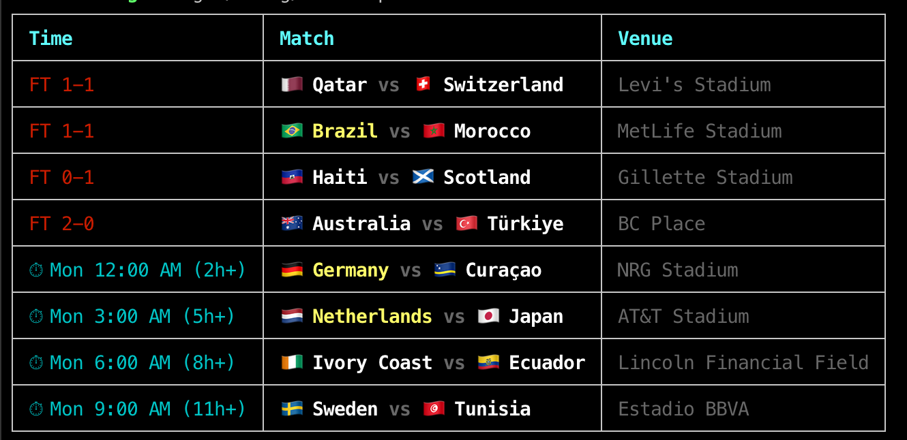

# worldcup

FIFA World Cup 2026 live info CLI tool. Fetches match data from ESPN's public API.

## Usage

```
cargo run                  # today's matches (including yesterday's FT)
cargo run -- next          # upcoming matches in next 7 days
```

## Example



Big teams (top 10 by ranking) are highlighted in yellow.

## Data source

ESPN public scoreboard API — no auth required.
